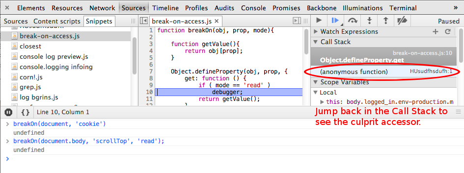

# Usage

> Omg the cookie is being changed, but where? Give me a breakpoint when JS changes my cookies!

    breakOn(document, 'cookie');

> Some JS is getting the `scrollTop` value causing massive Recalculate Styles costs. Who is the <del>perpetrator</del> <ins>PERFetrator</ins>?

    breakOn(document.body,'scrollTop', 'read')

This works really well as a [snippet in the Chrome DevTools](https://developers.google.com/chrome-developer-tools/docs/authoring-development-workflow#snippets):

<a href="https://developers.google.com/chrome-developer-tools/docs/authoring-development-workflow#snippets">

</a>

By default, breakOn will only break when JS attempts to change the value of a property. The third optional argument takes 'read' if you'd also like to break when values are read.

It is also possible to disable/enable a breakpoint by using methods provided by returned object.
```js
    var bp = breakOn(document, 'cookie');
    // found it!
    bp.disable();
    // something else is up....
    bp.enable();
```
breakOn also supports Conditional Breakpoints when the 4th argument is a function.
Say you know a property is being changed after the 4th change.
```js
    var i = 0;
    var bp = breakOn(document, 'cookie', false, function(v) {
        return i++ >= 4;
    });
```
Or something is leaving a property undefined
```js
    var bp = breakOn(document, 'cookie', false, function(v) {
        return typeof v === 'undefined';
    });
```
# Authors

Dave Methvin, Paul Irish, fat, and these [handsome people](https://github.com/paulirish/break-on-access/contributors)

# Alternatives

* [javascript-breakpoint-collection](https://github.com/mattzeunert/javascript-breakpoint-collection) by @mattzeunert. Find what code is causing a browser behavior. Very nice.
* [debug_utils](https://github.com/amasad/debug_utils) by @amasad has similar functionality, with a larger scope

# History

* [@fat](https://twitter.com/fat) blogged ["debugging javascript"](http://wordsbyf.at/2011/12/23/debugging-javascript-is-a-lame-title/) with an idea (attributed to [@mracus](http://twitter.com/mracus)) I'd talked about but hadn't seen yet

```js
Object.defineProperty(twttr, 'profile', {
    get: function () {
      debugger
    }
  , set: function (val) {
      debugger
    }
})
```
* I [asked for help](http://i.imgur.com/o6eaMmT.png) generalizing it and saving the initial value
* [Dave Methvin answered](https://gist.github.com/1676346) the call
* 18 months later I forked it, made this repo, and tried to ship it finally.
